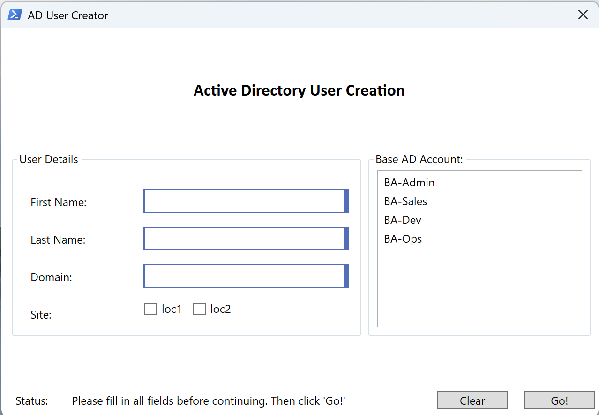

# 👤 Active Directory GUI User Creator

This PowerShell script launches a WPF interface for creating AD user accounts using predefined base role templates. It handles naming logic, attribute assignment, group membership cloning, and home directory setup—all through a clean, interactive form.

---

## 🧩 Features

- WPF GUI prompts for:
  - First name, last name, domain, site
  - Base account selection
- Smart SamAccountName generation and uniqueness handling
- Address parsing from site selection
- Group membership cloning from selected base account
- AD account creation with default password
- Optional home folder assignment via template path (`<user>` placeholder)

---

## 🖼️ GUI Preview

## ⚙️ Configurable Variables

| Variable               | Description |
|------------------------|-------------|
| `$default_password`    | Default password assigned to new AD accounts (converted to a SecureString) |
| `$loc_address1` / `$loc_address2` | Site-specific address details that populate city, state, ZIP, and street fields |
| `$OU_path`             | Distinguished Name path used to locate base accounts within Active Directory |
| `$home_directory`      | Template for home folder assignment (e.g., `\\server\homes\<user>`) — `<user>` is replaced with the generated SamAccountName |
| `$Base_Accounts`       | Array of base-role usernames used as templates for group membership and cloning |

---

## 🧪 Requirements

- PowerShell 5.1 or later  
- ActiveDirectory module installed  
- Domain administrator privileges  
- Network access to the target domain controller  
- GUI-compatible host (e.g., Windows 10 or Server 2016+)

---

## 🚀 Usage

PS C:\Scripts> .\ad-gui-user-creator.ps1

---

## ⚠️ Disclaimer

This tool was built for internal automation and shared in generalized form. It may need adjustments to suit your AD structure, naming policy, or site logic.